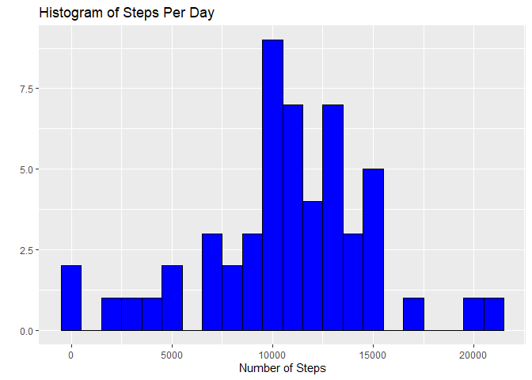
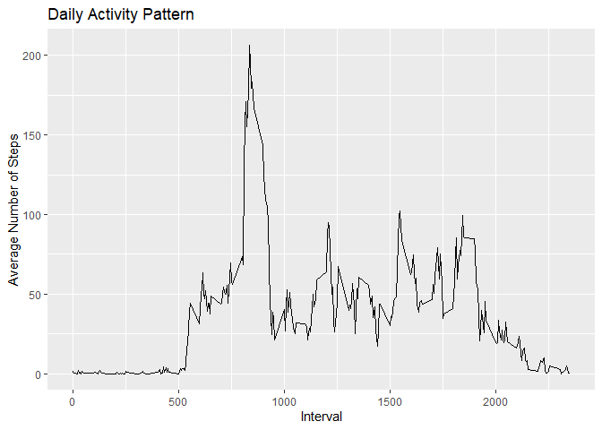
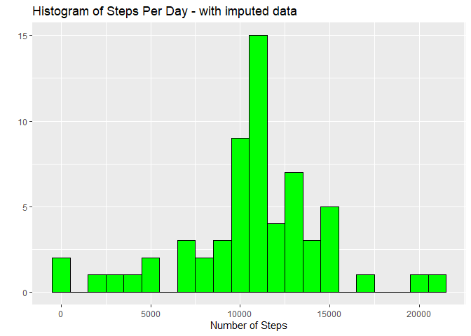
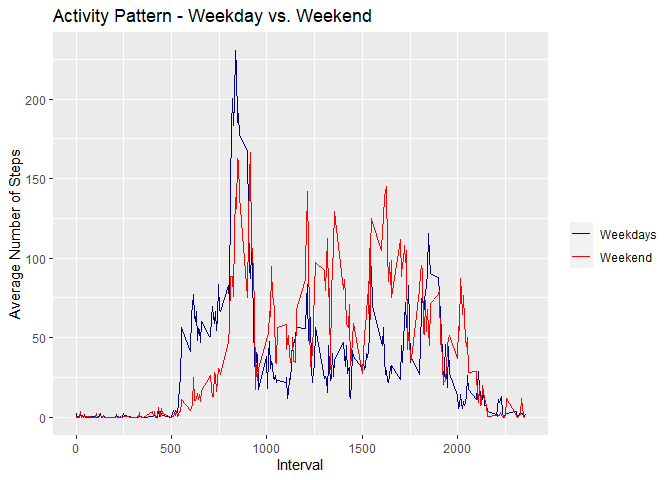

Week 2 - Final Assignment 
=======================================================


### Loading and preprocessing the data

Load relevant libraries, read the data and transform into a data frame: 

```r
library(dplyr)
library(ggplot2)
library(tidyr)

raw_data = read.csv("activity.csv", header = TRUE, sep = ",")

df_raw_data <- data.frame(raw_data)
```

### What is mean total number of steps taken per day?

For this part of the assignment, you can ignore the missing values in the dataset.

- Calculate the total number of steps taken per day
- Make a histogram of the total number of steps taken each day

Calculate and report the mean and median of the total number of steps taken per day.


```r
#group by date, remove NA, sum steps
df_steps_per_day <- df_raw_data %>%
        group_by(df_raw_data$date) %>%
        drop_na()%>%
        summarise_at(vars("steps"), sum)

#calculate average and median
mean_steps_per_day <- mean(df_steps_per_day$steps)
median_steps_per_day <- median(df_steps_per_day$steps)
```
The mean number of steps per day is 1.0766189\times 10^{4} and the median is 10765


This is the plot 


```r
colnames(df_steps_per_day)[1] = "date"
df_steps_per_day$date <- as.Date(df_steps_per_day$date)


ggplot(df_steps_per_day, aes(x = steps)) +
        geom_histogram(binwidth = 1000, fill = "blue", color = "black") +
        labs(title = "Histogram of Steps Per Day",
             x = "Number of Steps",
             y = "")
```

<!-- -->

### What is the average daily activity pattern?
Tasks:

- Make a time series plot of the 5-minute interval (x-axis) and the average number of steps taken, averaged across all days (y-axis)

- Which 5-minute interval, on average across all the days in the dataset, contains the maximum number of steps?

First, calculate the average across all days. Then find the maximum.  

```r
df_average_steps_per_interval <- df_raw_data %>%
        group_by(df_raw_data$interval) %>%
        drop_na() %>%
        summarise_at(vars("steps"), mean)

colnames(df_average_steps_per_interval)[1] = "interval"

max_activity_timeslot <- df_average_steps_per_interval[which.max(df_average_steps_per_interval$steps), ]
```


The maximum activity can be found in interval number 835, which can also be observed in this plot:


```r
ggplot(df_average_steps_per_interval, aes(x=interval, y=steps)) +
        geom_line()+
        labs(x = "Interval") +
        labs(y = "Average Number of Steps") +
        labs(title = "Daily Activity Pattern")
```

<!-- -->

### Imputing missing values

Note that there are a number of days/intervals where there are missing values (coded as NA). The presence of missing days may introduce bias into some calculations or summaries of the data.

- Calculate and report the total number of missing values in the dataset (i.e. the total number of rows with NAs)


```r
n_of_na_rows  <- sum(!complete.cases(df_raw_data))
```
2304 rows have missing values.


- Devise a strategy for filling in all of the missing values in the dataset. The strategy does not need to be sophisticated. For example, you could use the mean/median for that day, or the mean for that 5-minute interval, etc.
- Create a new dataset that is equal to the original dataset but with the missing data filled in.


```r
#impute missing values by using the before computed average steps per interval 

df_imputed <- merge(df_raw_data, df_average_steps_per_interval, by = "interval", all.x = TRUE)
df_imputed$steps <- ifelse(is.na(df_imputed$steps.x), df_imputed$steps.y, df_imputed$steps.x)

#remove unnecessary columns
df_imputed <- df_imputed %>%
        select(-steps.x, -steps.y)
```


- Make a histogram of the total number of steps taken each day and Calculate and report the mean and median total number of steps taken per day. Do these values differ from the estimates from the first part of the assignment? What is the impact of imputing missing data on the estimates of the total daily number of steps?


```r
#repeat computation as above
df_imp_steps_per_day <- df_imputed %>%
        group_by(df_imputed$date) %>%
        summarise_at(vars("steps"), sum)

#calculate mean and median
mean_imp_steps_per_day <- mean(df_imp_steps_per_day$steps)
median_imp_steps_per_day <- median(df_imp_steps_per_day$steps)

#plot data
ggplot(df_imp_steps_per_day, aes(x = steps)) +
        geom_histogram(binwidth = 1000, fill = "green", color = "black") +
        labs(title = "Histogram of Steps Per Day - with imputed data",
             x = "Number of Steps",
             y = "")
```

<!-- -->

Now, the mean number of steps per day is 1.0766189\times 10^{4} (before it was 1.0766189\times 10^{4}) and the median is 1.0766189\times 10^{4} (before it was 10765). Since I used the average number of steps to impute the data, there is almost no change in the overall average and median, which was to be expected.

### Are there differences in activity patterns between weekdays and weekends?

- Create a new factor variable in the dataset with two levels – “weekday” and “weekend” indicating whether a given date is a weekday or weekend day.

- Make a panel plot containing a time series plot of the 5-minute interval (x-axis) and the average number of steps taken, averaged across all weekday days or weekend days (y-axis). 


```r
#Create a factor variable 

df_imputed$weekday <- weekdays(as.Date(df_imputed$date))
weekenddays <- c('Samstag', 'Sonntag') #My host system is in German, might be different for you

#Use `%in%` and `weekenddays` to create a logical vector
#convert to `factor` and specify the `levels/labels`
df_imputed$week_day_end <- factor((df_imputed$weekday %in% weekenddays), 
                   levels=c(TRUE, FALSE), labels=c('weekend', 'weekday'))

#split into two data farmes for weekday vs. weekend
df_weekdays <- subset(df_imputed, df_imputed$week_day_end == "weekday")
colnames(df_weekdays)[1] = "interval"
df_weekend <- subset(df_imputed, df_imputed$week_day_end == "weekend")
colnames(df_weekend)[1] = "interval"

#do necessary calculations
df_avg_weekdays <- df_weekdays %>%
        group_by(df_weekdays$interval) %>%
        summarise_at(vars("steps"), mean)

colnames(df_avg_weekdays)[1] = "interval"

df_avg_weekend <- df_weekend %>%
        group_by(df_weekend$interval) %>%
        summarise_at(vars("steps"), mean)
colnames(df_avg_weekend)[1] = "interval"

df_avg_activity_merged <- merge(df_avg_weekdays, df_avg_weekend, by = "interval", all.x = TRUE)
colnames(df_avg_activity_merged)[2] = "steps_weekdays"
colnames(df_avg_activity_merged)[3] = "steps_weekends"

#plot data
ggplot(df_avg_activity_merged, aes(x=interval)) +
        geom_line(aes(y = steps_weekdays, color = "Weekdays"))+
        geom_line(aes(y = steps_weekends, color = "Weekend"))+
        scale_color_manual(name = "", values = c("Weekdays" = "darkblue", "Weekend" = "red")) +
        labs(x = "Interval") +
        labs(y = "Average Number of Steps") +
        labs(title = "Activity Pattern - Weekday vs. Weekend")
```

<!-- -->
